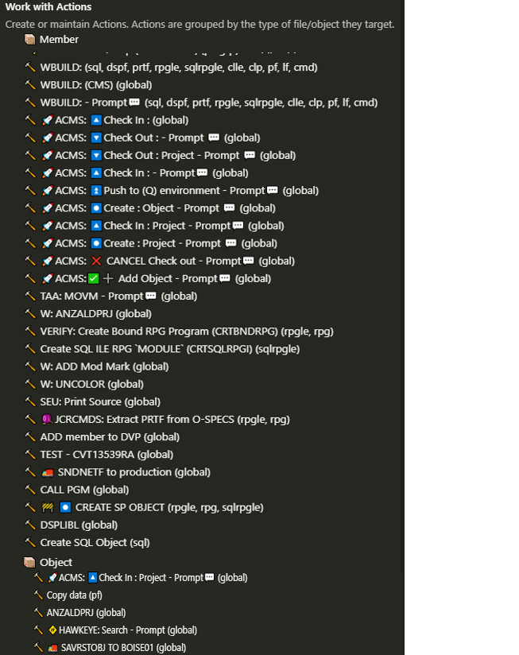
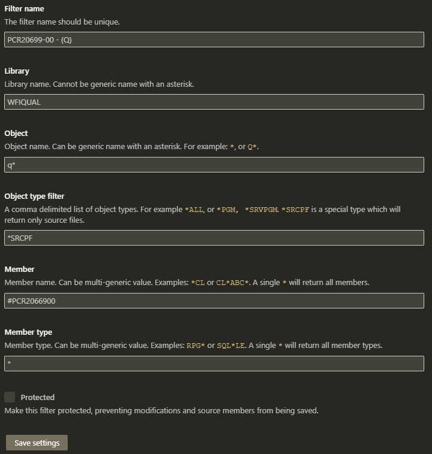

# Code for IBM i - Winco Fork

Using this fork to add in Winco personalized changes to the extension.  For instance, you can create filters that link to Aldon Project

## * Aldon tasks
  1. You have to create a filter that limits to one library environment.
  2. You can limit results to a certain source file by specifying a source file in the filter.
  3. To link this filter to an Aldon project, add this pattern in the member input, `#PCR#####VV`, where ##### is the PCr number and VV is the PCR version.

## * Actions added
  
  
## * Key short-cuts added
  * Atl+D : Delete Line
  * Alt+J : Join Line
  * Alt+T : Transform to Title Case
  * Alt+U : Transform to Upper Case
  * Alt+I : Transform to Lower Case
  * Shift+Alt+V : Convert to Free Format RPGLE
  * Ctrl+Alt+O : Open Outline View

[GitHub star this repo 🌟](https://github.com/codefori/vscode-ibmi)

Maintain your RPGLE, CL, COBOL, C/CPP on IBM i right from Visual Studio Code. Edit and compile all ILE languages, view errors inline, content assist for RPGLE and CL, source date support, and much more. Code for IBM i has thousands of daily users and a rapidly increasing number of downloads. We embrace open-source so that we can best support our community.

* [Install original from Marketplace](https://marketplace.visualstudio.com/items?itemName=HalcyonTechLtd.code-for-ibmi) 💻
* [Watch some tutorials](https://www.youtube.com/playlist?list=PLNl31cqBafCp-ml8WqPeriHWLD1bkg7KL) 📺
* [View Codefori documentation](https://codefori.github.io/docs/#/) 📘
* [See previous releases](https://github.com/codefori/vscode-ibmi/releases) 🔎
* Build from source (see below!) 🔨
* [Use our IBM i API in your own extension](https://codefori.github.io/docs/#/pages/api/extending) 🛠

 
 
 
 
 

---

### Building from source

1. This project requires VS Code and Node.js.
2. fork & clone repo
3. `npm i`
4. 'Run Extension' from vscode debug.

---

### Contributors

(Made with [contrib.rocks](https://contrib.rocks)).

View [our "contributing" page](CONTRIBUTING.md) for our contribution guidelines and a full list of contributors.  🕶️

* Aldon project filter example 
  